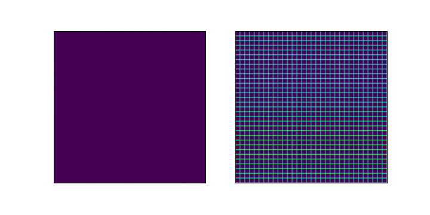

# Towards Sparse Federated Analytics: Location Heatmaps under Distributed Differential Privacy with Secure Aggregation
*Eugene Bagdasaryan, Peter Kairouz, Stefan Mellem, Adrià Gascón, Kallista Bonawitz, Deborah Estrin, Marco Gruteser*

This directory contains code to experiment with distributed differential
privacy for location heatmaps and based on [PETS'22 paper](https://arxiv.org/abs/2111.02356).
Here is the example of the algorithm running on NYC location map from 
[NYTimes](https://www.nytimes.com/2018/12/14/reader-center/phone-data-location-investigation.html):



To experiment with the code there is a working [notebook](dp_location_heatmaps.ipynb) 
with all the examples from the paper, please don't hesitate to contact the 
[author](mailto:eugene@cs.cornell.edu) or raise an issue.

For citation:
```
@inproceedings{bagdasaryan2022sparse,
      title={Towards Sparse Federated Analytics: Location Heatmaps under Distributed Differential Privacy with Secure Aggregation}, 
      author={Eugene Bagdasaryan and Peter Kairouz and Stefan Mellem and Adrià Gascón and Kallista Bonawitz and Deborah Estrin and Marco Gruteser},
      year={2022},
      bootkitle={PETS},
}
```