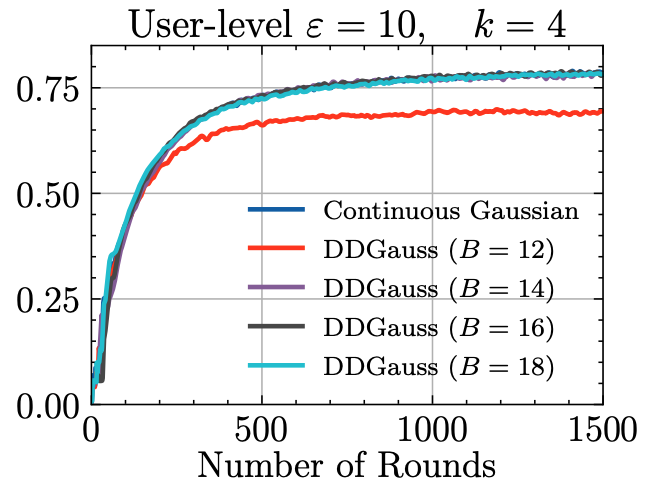

# Distributed Discrete Gaussian

## Overview

This directory contains the code for the paper "The Distributed Discrete
Gaussian Mechanism for Federated Learning with Secure Aggregation".
[[PDF](https://arxiv.org/pdf/2102.06387)][[arXiv](https://arxiv.org/abs/2102.06387)]

## Dependencies

-   Bazel (build tool for running the scripts)
-   Python dependencies: see `requirements.txt`.
-   Note: You may need the
    [nightly build](https://pypi.org/project/tensorflow-federated-nightly/) of
    Tensorflow Federated (TFF): `pip install tensorflow-federated-nightly`.

## Directory Structure

Run scripts:

-   `dme_run.py`: Runs the distributed mean estimation experiment.
-   `fl_run_emnist.py`: Runs the FL experiment on
    [Federated EMNIST](https://www.tensorflow.org/federated/api_docs/python/tff/simulation/datasets/emnist/load_data).
-   `fl_run_solr.py`: Runs the FL experiment on
    [StackOverflow](https://www.tensorflow.org/federated/api_docs/python/tff/simulation/datasets/stackoverflow/load_data).

Shared modules:

-   `accounting_utils.py`: Util functions for computing relevant privacy
    parameters.
-   `compression_utils.py`: Util functions for encoding client data (e.g.
    rotation, scaling, randomized rounding).
-   `discrete_gaussian_utils.py`: Implements sampling for the discrete Gaussian
    distribution.
-   `distributed_discrete_gaussian_query.py`: Implements the distributed
    discrete Gaussian mechanism as a `DPQuery` object from TensorFlow Privacy
    for simulations.
-   `compression_query.py`: Packs the compression util functions in a `DPQuery`
    object that can wrap the operations of another `DPQuery` object.
-   `modular_clipping_factory.py`: implements the TensorFlow Federated
    `tff.aggregators.AggregationProcessFactory` interface for applying modular
    clipping before and after aggregation. Used by the FL experiments.

## Running Experiments

There are two main components:

-   Distributed Mean Estimation (`dme_run.py`)
-   Federated Learning (`fl_run_emnist.py`, `fl_run_solr.py`)

### Distributed Mean Estimation

First, set the experiment parameters (e.g. bits, `n`, and `d`) in the Python
script `dme_run.py` for both the CLI flags and the constants in the `main()`
function.

#### Sequential Execution

Run the script with:

```
bazel run :dme_run
```

It also provides some basic plotting with the `--show_plot` flag. Note that by
default the above script runs everything sequentially.

#### Parallel Execution

For settings with larger `n` and `d`, different random dataset initializations
can be parallelized over different processes with a for-loop in `bash`:

```
for i in `seq 10`; do
  bazel run :dme_run -- --repeat=1 --run_id=$i --tag=my_test_run & done; wait
```

Then, combine and plot the results of the repeated parallel runs at
`/tmp/ddg_dme_outputs/my_test_run/` with:

```
python3 dme_merge_repeats.py /tmp/ddg_dme_outputs/my_test_run/
```

### Federated Learning

1.  Update the parameter flags in `fl_run_emnist.py` and `fl_run_solr.py`
    (Federated EMNIST and Stack Overflow Tag Prediction, respectively).
2.  Execute the script to start training (using EMNIST as an example):

```
bazel run :fl_run_emnist -- <flags>
```

The optimizer flags can be set as:

```
--server_optimizer=sgd --server_learning_rate=<slr> --server_sgd_momentum=0.9 \
--client_optimizer=sgd --client_learning_rate=<clr>
```

Example command to train on Federated EMNIST:

```
bazel run :fl_run_emnist -- \
    --server_optimizer=sgd \
    --server_learning_rate=1 \
    --server_sgd_momentum=0.9 \
    --client_optimizer=sgd \
    --client_learning_rate=0.03 \
    --experiment_name=my_test \
    --epsilon=10 \
    --l2_norm_clip=0.03 \
    --dp_mechanism=ddgauss \
    --logtostderr
```

Please refer to the paper for hyperparameter settings and set the flags
accordingly. Note that the training scripts by default do not configure hardware
accelerators.

### Privacy Degradation from Client Dropouts

The privacy degradation plot can be generated by running the Python script
directly:

```
python3 plot_client_dropout.py
```

## Result Highlights

Distributed discrete Gaussian achieves comparable utility to central
differential privacy (Gaussian mechanism) under the same privacy budget on
distributed mean estimation (left) and federated learning on EMNIST (right):



## Troubleshooting

-   If errors occur with calls to the TFF util libraries (mainly used by the FL
    training scripts), try using a TFF nightly build.

## Citation

```
@article{kairouz2021distributed,
  title={The Distributed Discrete Gaussian Mechanism for Federated Learning with Secure Aggregation},
  author={Kairouz, Peter and Liu, Ziyu and Steinke, Thomas},
  journal={arXiv preprint arXiv:2102.06387},
  year={2021}
}
```
