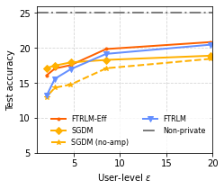
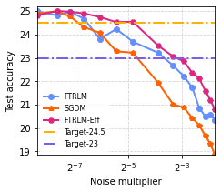
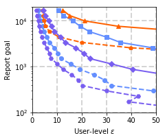
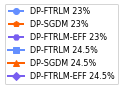

# DP-FTRL in Federated Learning

## Overview

Implements and experiments with DP-FTRLM (momentum variant of differentially
private follow-the-regularized-leader) in federated learning. See "Practical and
Private (Deep) Learning without Sampling or Shuffling"
([arXiv link](https://arxiv.org/abs/2103.00039)) for algorithmic details. The
code in this folder is for the StackOverflow federated learning (FL) experiments
in the paper.

NOTE: The implementation and experiments for centralized setting on image
datasets can be found at
[another repository](https://github.com/google-research/DP-FTRL).

This folder is organized as following,

*   Two python drivers `run_emnist` and `run_stackoverflow` for
    [EMNIST](https://www.tensorflow.org/federated/api_docs/python/tff/simulation/datasets/emnist)
    and
    [StackOverflow](https://www.tensorflow.org/federated/api_docs/python/tff/simulation/datasets/stackoverflow).
*   The training loops is defined in `training_loop`. Compared to
    `utils.training_loop`, this customized `training_loop` adds the possibility
    of training by both epochs of clients shuffling and rounds of clients
    sampling.
*   TFF iterative process builder `dp_fedavg` based on TFF
    [`simple_fedavg` example](https://github.com/tensorflow/federated/tree/master/tensorflow_federated/python/examples/simple_fedavg).
    Major changes: accept a customized class as server optimizers; add the
    option of clipping model delta before sending back to server for
    differential privacy.
*   `optimizer_utils` defined several custimized optimizers including a simple
    reimplementation of SGD, differential private SGD with momentum (DP-SGDM)
    and differential private FTRL with momentum (DP-FTRLM).
*   `tree_aggregation` defined the noise accumulation by a tree structure for
    DP-FTRLM.

TODO(b/172867399): add privacy computation method.

## Requirements

This code is implemented with
[TensorFlow Federated](https://www.tensorflow.org/federated). See
[Using TFF for Federated Learning Research](https://www.tensorflow.org/federated/tff_for_research)
for more instructions on using TensorFlow Federated for research.

The following packages may need to be installed

<!-- mdformat off (multiple lines of small code piece) -->

```bash
absl-py~=0.10
attrs~=19.3.0
numpy~=1.19.2
pandas~=0.24.2
tensorflow-federated-nightly
tf-nightly
```

<!-- mdformat on -->

## Example usage

The following command is an example for the DP-FTRLM results in Section 5.3 of
"Practical and Private (Deep) Learning without Sampling or Shuffling".

```bash
bazel run run_stackoverflow.py --experiment_name=stackoverflow_ftrlm_smalln --server_optimizer=dpftrlm --total_epochs=1 --total_rounds=1600 --client_lr=0.5 --server_lr=3 --clip_norm=1 --noise_multiplier=0.067
```

> NOTE: this code version includes two variants compared to the implementation
> used for StackOverflow results in the first version of "Practical and Private
> (Deep) Learning without Sampling or Shuffling"
> [on arxiv](https://arxiv.org/abs/2103.00039v1).
>
> 1.  Efficient tree aggregation is the default in this repository. The
>     advantage of efficient tree aggregation can found in the
>     [following section](#efficient-tree-aggregation). To reproduce results in
>     the paper, please manually set `efficient_tree=False` for
>     `optimizer_utils.DPFTRLMServerOptimizer`.
> 1.  This code version uses the up-to-date version of StackOverflow data
>     processing and other `utils/` functions including functions migrated to
>     `tff.simulation`, while the arxiv paper uses an older version. The changes
>     should have minimum effects but might cause minor issues to reproduce the
>     exact results in the paper.

## Efficient tree aggregation

The tree aggregation algorithm in this repo defaults to the efficient algorithm
described in (Honaker 2015 "Efficient Use of Differentially Private Binary
Trees"), which leads to a better privacy computation trade-off compared to the
first version of "Practical and Private (Deep) Learning without Sampling or
Shuffling" [on arxiv](https://arxiv.org/abs/2103.00039v1). The following figures
show the efficient tree aggregation results corresponding to Figure 2 in the
paper [on arxiv](https://arxiv.org/abs/2103.00039v1); the curves with suffix
"-Eff" are generated by using the efficient tree aggregation.






For target test accuracy 24.5%, the maximum noise multiplier can increase from
0.067 ([in arxiv draft](https://arxiv.org/abs/2103.00039v1)) to 0.149; for
target test accuracy 23%, the maximum noise multiplier can increase from 0.268
([in arxiv draft](https://arxiv.org/abs/2103.00039v1)) to 0.387. This suggests
that stronger privacy accounting can be achieved for the targeted utilities with
the efficient tree aggregation method.

## Citation

```
@article{kairouz2021practical,
  title={Practical and Private (Deep) Learning without Sampling or Shuffling},
  author={Kairouz, Peter and McMahan, H Brendan and Song, Shuang and Thakkar, Om and Thakurta, Abhradeep and Xu, Zheng},
  journal={arXiv preprint arXiv:2103.00039},
  year={2021}
}
```
