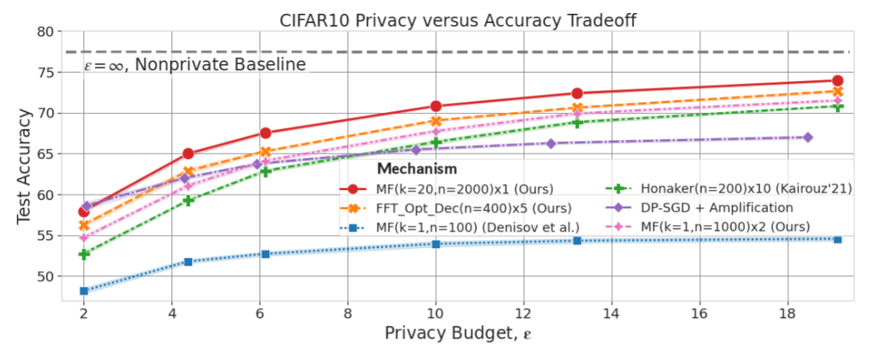
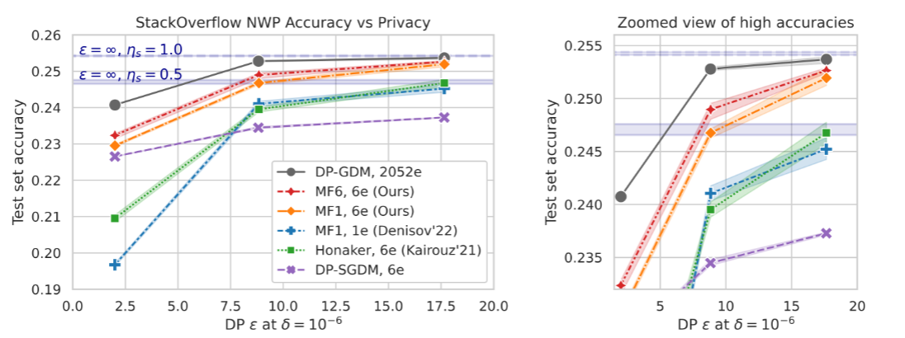
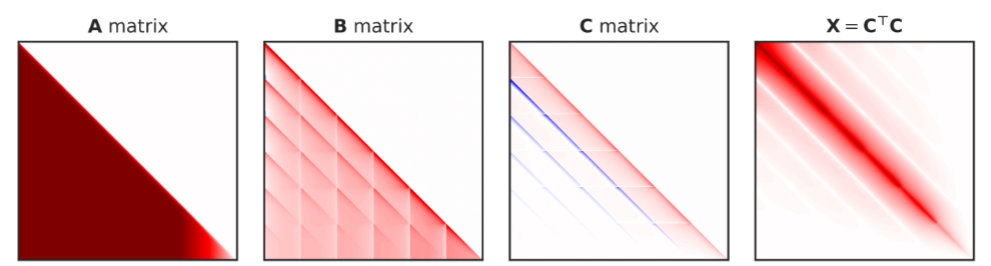

This repository contains the code to reproduce experiments from "Multi-Epoch
Matrix Factorization Mechanisms for Private Machine Learning" found at
[[PDF](https://arxiv.org/pdf/2211.06530.pdf)][[arXiv](https://arxiv.org/abs/2211.06530)]
and published at ICML 2023.

Multi-epoch matrix factorization or, ME-MF, is a form of MF-DPFTRL approach. Our
main contributions are:

1.  a new method for capturing sensitivity in the multi-epoch setting, (Section
    2 of the paper),

2.  showing how to optimize matrices under this sensitivity constraint (Section
    3), which leads us to

3.  the creation of new state-of-the-art mechanisms for DP-ML (as evaluated in
    Section 5). We show how to "plug-and-play" our methods into existing DP-SGD
    optimization algorithms.

# Result Highlights

We consistently outperform DP-SGD to as low as ε≈2 on both CIFAR-10 (top) and
Stackoverflow Next Word Prediction (bottom). This can be observed from the red
lines on each graph. Further, observe that we achieve near the folklore
upper-bound of full-batch gradient descent as shown on the Stackoverflow
results. Finally, it is important to note our work shows new state-of-the-art DP
mechanisms---any additional improvements that have been studied for DP-SGD (like
using public data, augmentations, and more) are likely applicable to our setting
and we are excited to see them built on our work!




In the below, we show what our matrices look like. **A** represents the
workload, here, for Stackoverflow which shows a prefix-sum workload with
learning rate cooldown and momentum factorized for (discussed in more detail
below). **B** is the decoder used for noise generation, and **C** is the encoder
whose sensitivity we bound.



# Background

Throughout this document, we will refer to the DP stochastic gradient descent
(SGD) algorithm of [2] as DP-SGD and our multi-epoch matrix factorization work
as MEMF-DP-FTRL.

# Directory Structure

-   The `dp_ftrl` package contains much of the run code for training models with
    our DP-FTRL-based approaches.

*   The `dp_ftrl`.`centralized` subdirectory contains the training loops and
    noise generation code for centralized training. This also contains the run
    script for generating the matrices under the file
    `dp_ftrl`.`centralized`.`generate_and_write_matrices.py`.

-   The `fft` package contains code pertaining to the FFT mechanism in the
    paper. In particular, it contains code for bounding sensitivity and for
    pre-generating noise for the FFT approach. Representing these as their
    corresponding matrix mechanism is contained in the above directory.

-   The `multiple_participations` package contains the core code for bounding
    sensitivity and optimizing our multi-epoch matrices.

-   The main top-level modules contain common utilities for all of the above
    tasks.

## Differentially Private (DP) Machine Learning (ML)

DP-SGD, the current go-to algorithm for DP-ML is based on the following 4 steps.

1.  Instead of computing a single gradient for the mean loss, compute a gradient
    for each example, termed "per-example gradients".

2.  clip each per-example gradient one to some chosen threshold, known as the l2
    clipping norm.

3.  Compute the average gradient from the per-example gradients.

4.  Add Gaussian noise *z* of standard deviation σ where σ is calibrated to
    achieve some chosen (ε, δ)-DP guarantee.

To leverage our MEMF-DP-FTRL, we only need to change what noise we add to each
step of DP-SGD. This can be translated to adding the following step 5.

*   Given *z* generated from 4. above, correlate it by using the mechanism
    **Bz**, where **B** is generated according to the training dynamics, as we
    will discuss below. Equivalently, given **A** and **C**, where the former
    will be pre-specified and the second optimized for (as discussed more below)
    we generate noise as **AC^{-1}z**. Thus, the pair **A**,**C** specifies the
    given matrix mechanism. TODO(b/285952627) to expand on this.

## DP-FTRL

TODO(b/285952627)

## Matrix Factorization

TODO(b/285952627)

# Try it out!

## Decide on Training Dynamics

The first step is to decide on the training dynamics that will be used. This is
because these training dynamics will be directly modeled into the optimization
procedure, allowing us to generate a mechanism that is optimal (in the total
error). The following are what must be decided on a priori.

1.  The number of epochs (max number of participations per example/user). This
    is *k*. As well, the number of steps between each participation, this is
    *b*. This can be calculated as the dataset size (*m*) divided by the batch
    size, i.e., both must be chosen in advance.

2.  The workload matrix **A** must be chosen in advance. In particular, there
    are a few options, where all are distinctly lower-triangular:

*   The prefix sum workload, corresponding to lower triangular **A** with
    entries all 1. This corresponds to machine learning of the prefix sums and,
    through a simple post-processing via the
    `tff_aggregator.create_residual_prefix_sum_dp_factory` function, to SGD.
    Notice that instead of learning the current model at each step, as in prefix
    sums, this will return a decoder matrix **B** augmented for a workload **A**
    for the residuals, i.e., the gradient update as returned by SGD at each
    step. Our CIFAR-10 results use these workloads, with learning rate cooldown
    and momentum passed to the SGD optimizer rather than directly optimized for
    in the matrices, as is possible and discussed below.

*   The momentum workload, for some momentum parameter. The exact parameter must
    be chosen in advance.

*   The learning rate cooldown workload, for some per-round learning rates
    chosen a priori.

*   Momentum workload and learning rate cooldown. This is the setting used for
    our Stack Overflow Next Word Prediction Experiments.

## Generating Matrices

To generate matrices for CIFAR-10, the
`dp_ftrl`.`centralized`.`generate_and_write_matrices`.py run script will do
this. As mentioned above, our CIFAR-10 results assume the prefix sum workload.
Thus, this is assumed in this script. To generate matrices for other workloads,
in particular for the Stackoverflow results, it is necessary to use the code in
`multiple_participations`.

To do this, ... TODO(b/285952627)

## Train!

To train models using our approach, it suffices to call the run scripts with the
path to the saved matrix using the corresponding training dynamics chosen
earlier, and specifying any remaining choices. For example, the noise multiplier
must be specified to attain a chosen DP guarantee. The `accounting`.py module
contains the relevant code under the assumption that the l2_clip_norm is 1.

The run scripts needed are:

-   `dp_ftrl`.`centralized`.`run_training`.py for CIFAR-10.
-   `dp_ftrl`.`run_stackoverlow`.py for Stackoverflow.

# Citations

This manuscript will be appearing in ICML 2023 as an oral presentation and
poster!

```
@article{choquette2022multi,
  title={Multi-Epoch Matrix Factorization Mechanisms for Private Machine Learning},
  author={Choquette-Choo, Christopher A and McMahan, H Brendan and Rush, Keith and Thakurta, Abhradeep},
  journal={arXiv preprint arXiv:2211.06530},
  year={2022}
}
```

# Troubleshooting

-   If errors occur with calls to the TFF util libraries (mainly used by the FL
    training scripts), try using a TFF nightly build.

# References

[1] Choquette-Choo, Christopher A., et al. "Multi-Epoch Matrix Factorization
Mechanisms for Private Machine Learning." arXiv preprint arXiv:2211.06530
(2022).

[2] Goodfellow, Ian, Yoshua Bengio, and Aaron Courville. Deep learning. MIT
press, 2016.
