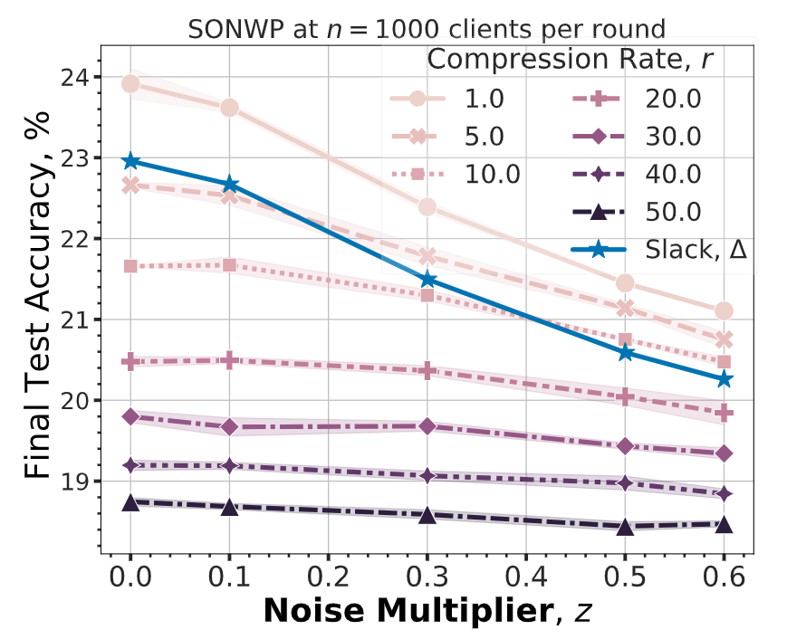
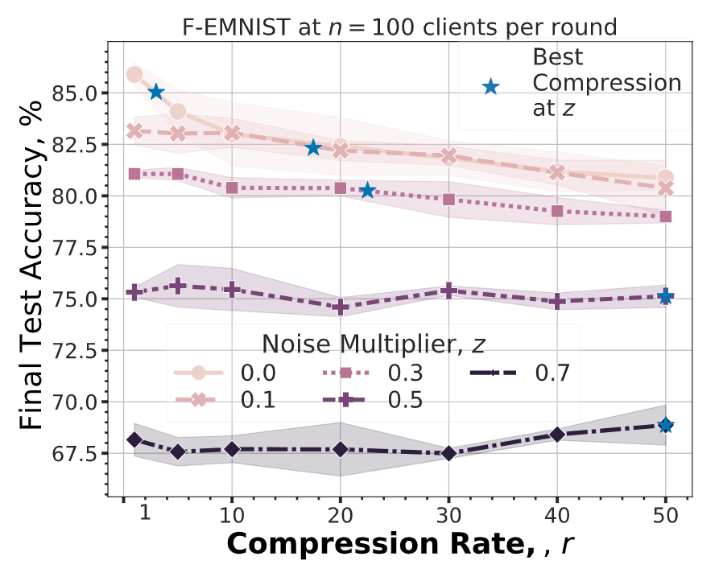
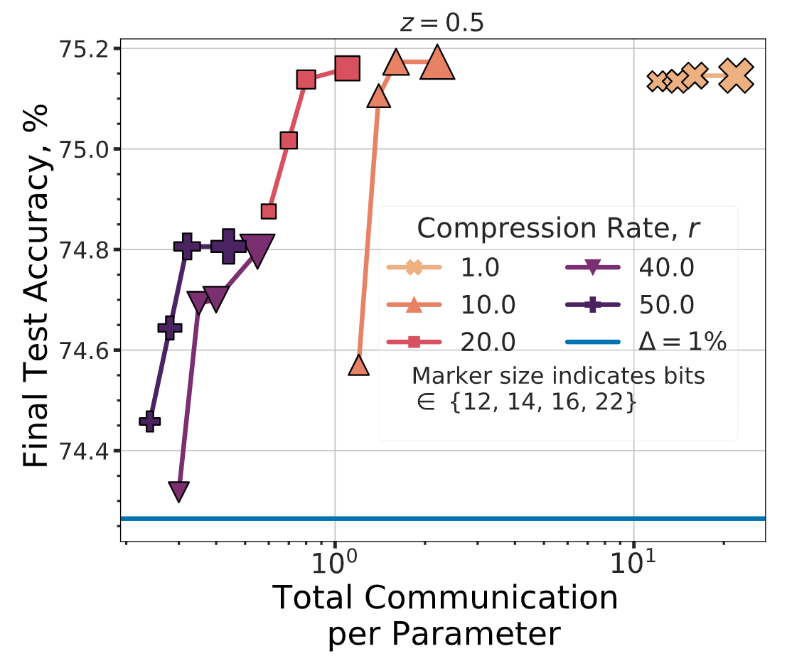

# Private Linear Compression

## Overview

This directory contains the code for the paper "The Fundamental Price of Secure
Aggregation in Differentially Private Federated Learning", found at:
[[PDF](https://arxiv.org/pdf/2203.03761.pdf)][[arXiv](https://arxiv.org/abs/2203.03761)].

## Dependencies

-   Bazel (build tool for running the scripts)
-   Python dependencies: see `requirements.txt`.
-   Note: You may need the
    [nightly build](https://pypi.org/project/tensorflow-federated-nightly/) of
    Tensorflow Federated (TFF): `pip install tensorflow-federated-nightly`.

## Directory Structure

Run scripts:

-   `fl_compression_run.py`: Runs the FL experiments on different tasks:
    -   [Federated EMNIST](https://www.tensorflow.org/federated/api_docs/python/tff/simulation/datasets/emnist/load_data)
    -   [Stack Overflow](https://www.tensorflow.org/federated/api_docs/python/tff/simulation/datasets/stackoverflow/load_data)

Shared modules:

-   `count_sketching.py`: Defines the `GradientCountSketchFactory` which uses
    count sketching to compress gradient vectors.
-   `count_sketching_utils.py`: Util functions for implementing count sketching
    of gradient vectors.
-   `ddp_compression.py`: Packs and wraps compression with Distributed
    Differential Privacy and Secure Aggregation.

## Running Experiments

See:

-   Federated Learning (`fl_compression_run.py`)
-   Distributed Mean Estimation (`dme_run.py`)

### Distributed Mean Estimation

Run the `dme_run.py` script to perform this experiment.

```
bazel run :dme_run -- <flags>
```

See the arguments in the file for their descriptions. The defaults correspond to
the setup used in the paper.

To visualize results, run `dme_merge_and_plot.py`.

### Federated Learning

Run the `fl_compression_run.py` script to start training:

```
bazel run :fl_compression_run -- <flags>
```

The task flags are defined in the format of:

```
--task=<task_name> --<task_name>_<task_args1>=... --<task_name>_<task_args2>=...
```

where `task_name` is one of the options from `utils/task_utils.py`, and
`task_args` are defined according to the task constructors at
`tff.simulation.baselines.*`.

The optimizer flags can be set as:

```
--server_optimizer=sgd --server_learning_rate=<slr> --server_sgd_momentum=0.9 \
--client_optimizer=sgd --client_learning_rate=<clr>
```

Example command to train on Federated EMNIST:

```
bazel run :fl_compression_run -- \
    --task=emnist_character \
    --server_optimizer=sgd \
    --server_learning_rate=1 \
    --server_sgd_momentum=0.9 \
    --client_optimizer=sgd \
    --client_learning_rate=0.03 \
    --client_batch_size=20 \
    --experiment_name=my_emnist_test \
    --logtostderr
```

For Stack Overflow tasks, the following flags should also be set:

-   `--num_validation_examples=10000`
-   `--max_elements_per_client=256` (next word prediction)
-   `--max_elements_per_client=1000` (tag prediction)

Please refer to the paper for hyperparameter settings and set the flags
accordingly. Note that the training scripts by default do not configure hardware
accelerators.

## Result Highlights

Up to 10X compression can be attained at nearly no cost
(<4% relative accuracy degradation) in performance on Stack Overflow next-word prediction. We observe this for noise multipliers z>=0.5.
On Federated-EMNIST, upwards of 50x compression can be attained with
<1% relative accuracy degradation and z>=0.5.

**Left:** Stack Overflow next-word prediction. **Right:** Federated-EMNIST.



Optimizing both quantization and linear dimensionality reduction via sketching,
we can obtain as low as 0.24 bits per parameter on Federated-EMNIST (below) and
1.2 bits per parameter on Stack Overflow (not shown, see paper for more
details). This far exceeds just quantization which achieves only 10 bits per
parameter.



## Troubleshooting

-   If errors occur with calls to the TFF util libraries (mainly used by the FL
    training scripts), try using a TFF nightly build.

## Citations

This manuscript will be appearing in ICML 2022!

```
@article{chen2022fundamental, title={The Fundamental Price of Secure Aggregation
in Differentially Private Federated Learning}, author={Chen, Wei-Ning and
Choquette-Choo, Christopher A and Kairouz, Peter and Suresh, Ananda Theertha},
journal={arXiv preprint arXiv:2203.03761}, year={2022} }
```
